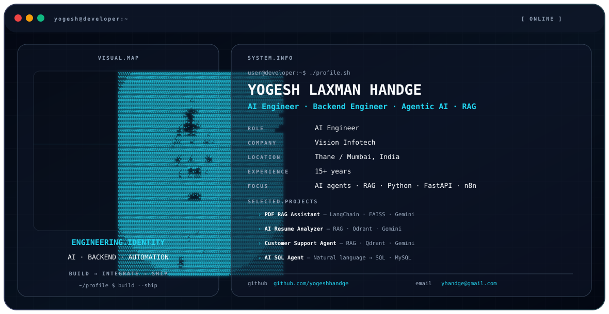

# YOGESH LAXMAN HANDGE 👋

<picture>
  <source media="(prefers-color-scheme: dark)" srcset="./dark.svg">
  <source media="(prefers-color-scheme: light)" srcset="./light.svg">
  
</picture>

## About

AI Engineer and Backend Engineer with 15+ years of software engineering experience, focused on production-oriented AI applications, agentic workflows, RAG systems, backend APIs and automation.

I build with Python, FastAPI, LangChain, LangGraph, n8n, LLM APIs, vector databases, REST APIs, Docker, CI/CD and cloud platforms.

## What I Build

- AI agents and agentic workflows
- Retrieval-Augmented Generation (RAG)
- LLM-powered applications
- AI automation and workflow orchestration
- Python / FastAPI backend systems
- API and webhook integrations
- Production engineering and observability

## Featured Projects

- **[PDF RAG Assistant](https://github.com/yogeshhandge/pdf-rag-assistant)** — LangChain, HuggingFace Embeddings, FAISS, Google Gemini and Streamlit.
- **[AI Resume Analyzer](https://github.com/yogeshhandge/AI-Resume-Analyzer-using-RAG-Qdrant-Gemini)** — RAG, Qdrant, Gemini and Sentence Transformers for resume/JD analysis.
- **[AI Customer Support Agent](https://github.com/yogeshhandge/customer_support_agent)** — document-based RAG assistant using Qdrant and Gemini.
- **[AI SQL Agent](https://github.com/yogeshhandge/sql_agent)** — natural-language-to-SQL application using Gemini and MySQL.
- **[vTaskManager](https://github.com/yogeshhandge/vTaskManager)** — existing full-stack application project.

## Stack

**AI:** LangChain · LangGraph · RAG · LLMs · Embeddings · Tool Calling

**Backend:** Python · FastAPI · Node.js · Express.js · PHP · Laravel

**Data:** PostgreSQL · MySQL · MongoDB · Redis · Qdrant · FAISS · ChromaDB

**Automation:** n8n · REST APIs · Webhooks · Meta WhatsApp Cloud API

**Cloud / DevOps:** AWS · AWS Bedrock · Docker · Docker Compose · Nginx · GitHub Actions · CI/CD

**Observability:** Prometheus · Grafana · Grafana k6 · p95 latency analysis

## Connect

- GitHub: https://github.com/yogeshhandge
- Email: yhandge@gmail.com

> Building AI systems with a strong software-engineering foundation: **prototype fast, integrate cleanly, ship reliably.**
